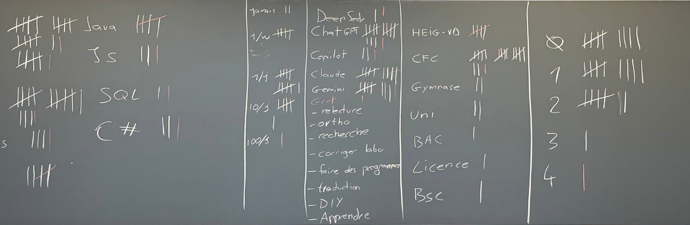

# Semaine 01/16

## Expérience des étudiant-es

## Références

Cours en ligne: [https://heig-tin-info.github.io/handbook/](https://heig-tin-info.github.io/handbook/)

Cartes de référence: [https://heig-cheatsheet.github.io/web/](https://heig-cheatsheet.github.io/web/)
## Linux ou Windows ?

Windows domine largement dans le secteur de la bureautique, mais Linux est très utilisé dans le monde de l’informatique et du développement. Un satellite, un avion de chasse, un serveur web, un supercalculateur ou un robot humanoïde fonctionnent tous sous Linux. Il est donc important de savoir utiliser Linux, même si vous utilisez Windows au quotidien.

Depuis 2016, Microsoft a intégré un sous-système Linux dans Windows 10 et Windows 11. Il est donc possible d’utiliser Linux sur Windows sans avoir besoin de virtualisation. Vous pouvez ainsi utiliser les outils Linux directement depuis Windows. C'est l'outil WSL que nous allons utiliser dans ce cours.

## Résumé du labo-00

- Utilisation des raccourcis clavier sous Windows (`WIN+E`, `WIN+R`, `ALT+TAB`, `WIN+TAB`, `WIN+L`, `WIN+D`, `CTRL+SHIFT+ESC`).
- Utilisation de la calculatrice
- Configuration de Git et GitHub
- Installation de WSL et Ubuntu
- Installation de Visual Studio Code et des extensions nécessaires
